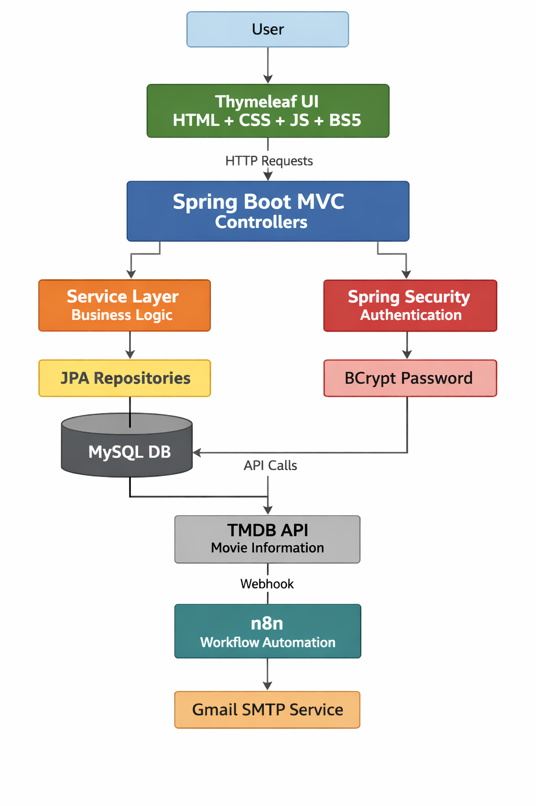
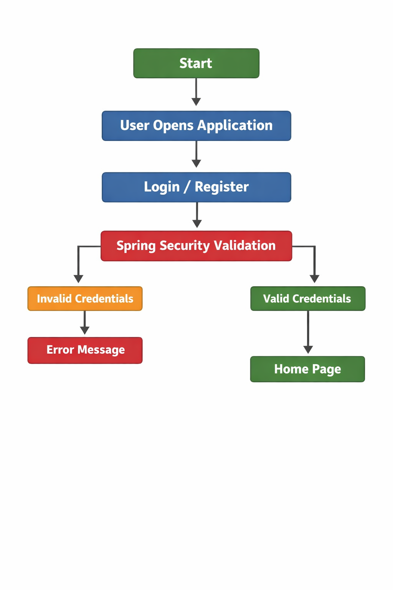
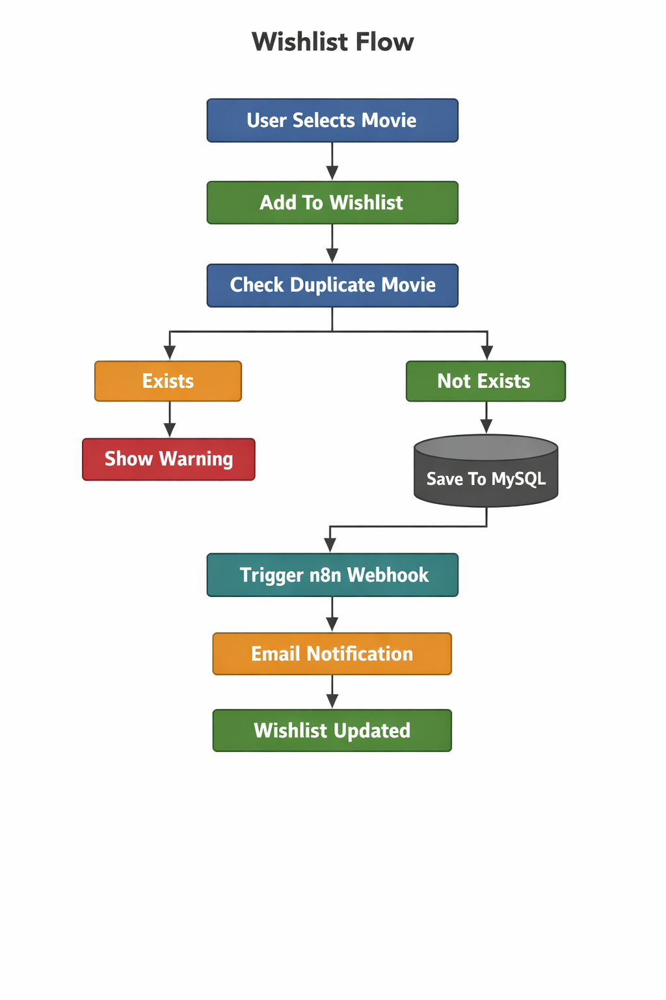
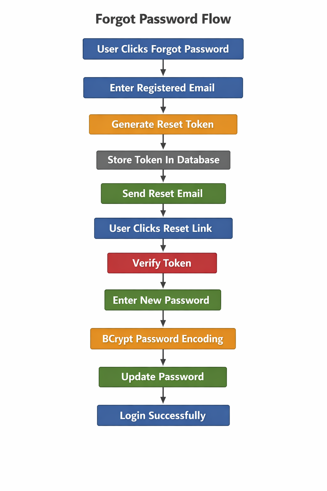
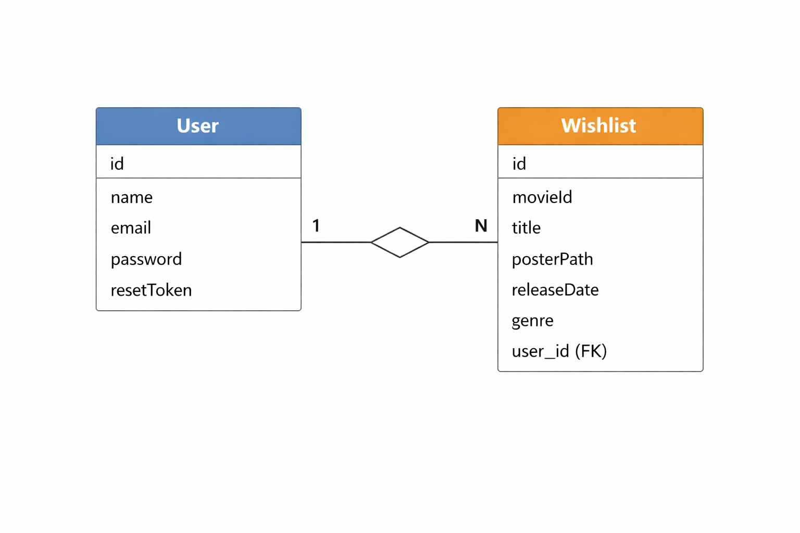
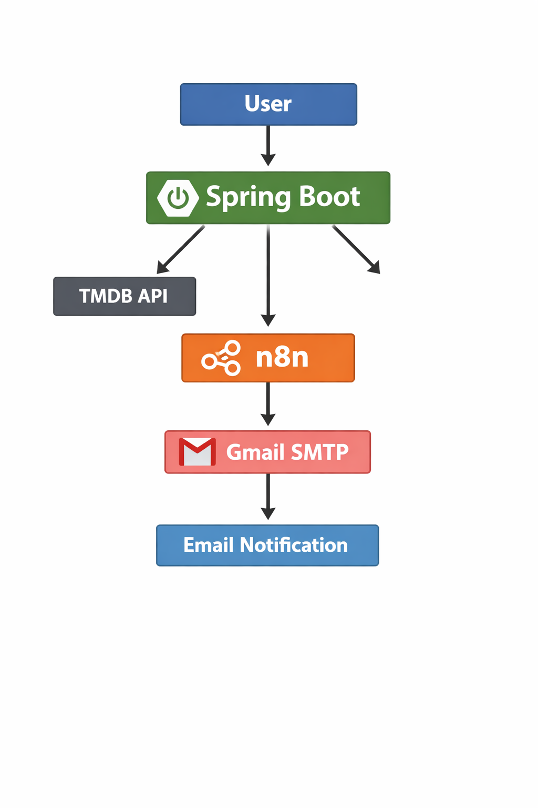

# 🎬 Movie Wishlist Application

A full-stack movie discovery and wishlist management application built using **Spring Boot**, **Thymeleaf**, **MySQL**, and **TMDB API**. Users can search for movies, explore trending and upcoming releases, create personalized wishlists, and receive automated notifications through **n8n workflows**.

---

## 🚀 Features

### 🔐 Authentication & Authorization

* User Registration
* User Login & Logout
* Secure Password Encryption using BCrypt
* Session-Based Authentication
* Forgot Password & Reset Password Workflow

### 🎥 Movie Discovery

* Search movies using TMDB API
* Live Search Suggestions
* Trending Movies Section
* Upcoming Blockbuster Movies Section
* Genre-wise Movie Collections

  * Action Movies
  * Comedy Movies
  * Sci-Fi Movies

### ❤️ Wishlist Management

* Add Movies to Wishlist
* Remove Movies from Wishlist
* Personalized Wishlist per User
* Duplicate Prevention
* Custom Movie Addition

### 👤 User Profile Management

* View Profile
* Edit Profile
* Change Password
* Profile Modal Interface
* Responsive Mobile-Friendly Design

### 📧 Notification System

* Integration with n8n Automation Platform
* Email Notifications on:

  * Movie Added to Wishlist
  * Movie Removed from Wishlist
* Gmail SMTP Integration

### 🎨 Modern UI Features

* Responsive Design
* Dark/Light Theme Toggle
* Interactive Movie Cards
* Mobile Optimized Layout
* Hover Effects & Animations
* Toast Notifications
* Profile Initials Avatar

---

## 🛠️ Technology Stack

### Frontend

* HTML5
* CSS3
* Bootstrap 5
* JavaScript
* Thymeleaf

### Backend

* Java 21
* Spring Boot 3
* Spring MVC
* Spring Security
* Spring Data JPA
* Hibernate

### Database

* MySQL

### External APIs

* TMDB (The Movie Database API)

### Automation

* n8n Workflow Automation
* Gmail SMTP

---

## 📂 Project Structure

```text
src
├── main
│   ├── java
│   │   └── com.moviewishlist
│   │       ├── controller
│   │       ├── service
│   │       ├── repository
│   │       ├── model
│   │       ├── config
│   │       └── security
│   │
│   ├── resources
│   │   ├── templates
│   │   ├── static
│   │   │   ├── css
│   │   │   ├── js
│   │   │   └── sounds
│   │   └── application.properties
│
└── pom.xml
```

---
---

# 🏗️ System Architecture

<p align="center">
  
</p>

---

# 🔄 Application Flow Diagrams

## 🔐 User Authentication Flow

<p align="center">
  
</p>

## ❤️ Wishlist Management Flow

<p align="center">
  
</p>

## 🔑 Forgot Password Flow

<p align="center">
  
</p>

# 🗄️ Database ER Diagram

<p align="center">
  
</p>

# 🌐 External Integrations

<p align="center">
  
</p>


### Integrated Services

#### 🎬 TMDB API

Used for:

- Movie Search
- Trending Movies
- Upcoming Movies
- Genre-based Recommendations
- Movie Metadata Retrieval

#### 🔄 n8n Workflow Automation

Used for:

- Wishlist Event Processing
- Notification Automation
- Webhook Handling

#### 📧 Gmail SMTP

Used for:

- Password Reset Emails
- Wishlist Notification Emails
- Automated User Alerts

---


## ⚙️ Configuration

### Database Configuration

```properties
spring.datasource.url=jdbc:mysql://localhost:3306/moviewishlist_db
spring.datasource.username=root
spring.datasource.password=your_password

spring.jpa.hibernate.ddl-auto=update
spring.jpa.database-platform=org.hibernate.dialect.MySQLDialect
```

### TMDB Configuration

```properties
tmdb.api.token=YOUR_TMDB_ACCESS_TOKEN
```

### n8n Configuration

```properties
n8n.enabled=true
n8n.webhook.url=http://localhost:5678/webhook-test/movie-notifications
```

---

## 📦 Installation

### Clone Repository

```bash
git clone https://github.com/yourusername/movie-wishlist.git
cd movie-wishlist
```

### Create Database

```sql
CREATE DATABASE moviewishlist_db;
```

### Configure Application

Update:

```properties
src/main/resources/application.properties
```

with your:

* MySQL Credentials
* TMDB Token
* n8n Webhook URL

### Run Application

```bash
mvn clean install
mvn spring-boot:run
```

Application starts at:

```text
http://localhost:8080
```

---

## 🎯 Key Functionalities

### Search Movies

Users can search movies in real-time using TMDB API.

### Explore Movies

Browse:

* Trending Movies
* Upcoming Blockbusters
* Action Movies
* Comedy Movies
* Sci-Fi Movies

### Wishlist Management

Users can:

* Add movies
* Remove movies
* View personalized wishlist

### Automated Notifications

n8n workflows automatically send email notifications when wishlist changes occur.

---

## 🔒 Security Features

* BCrypt Password Hashing
* Session Management
* Protected Routes
* Input Validation
* CSRF Protection Support

---

## 📱 Responsive Design

The application is optimized for:

* Desktop
* Laptop
* Tablet
* Mobile Devices

Features:

* Mobile Movie Grid
* Responsive Navigation Bar
* Adaptive Profile Panel
* Touch Friendly Controls

---

## 🌟 Future Enhancements

* Movie Recommendations
* AI Movie Assistant
* Watchlist Reminders
* Movie Reviews & Ratings
* Social Sharing
* Multi-language Support
* OAuth Login (Google/GitHub)
* Movie Release Alerts

---

## 📜 License

This project is developed for educational and learning purposes.
